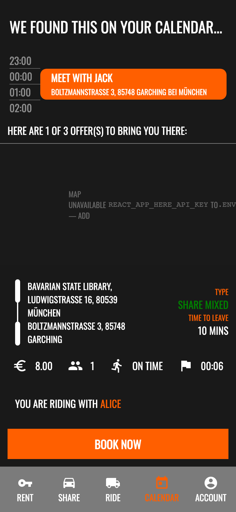
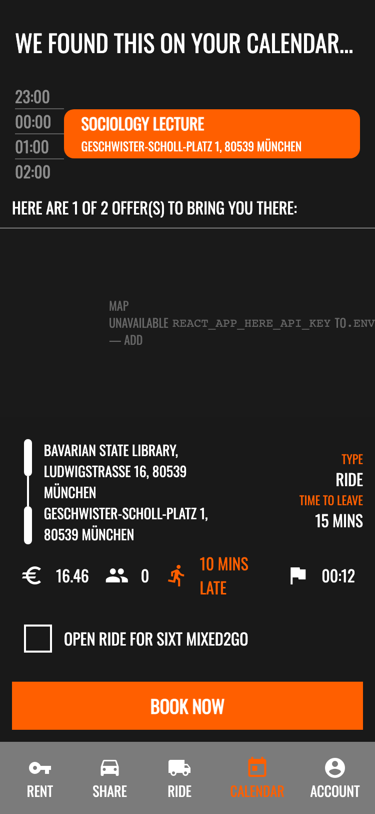
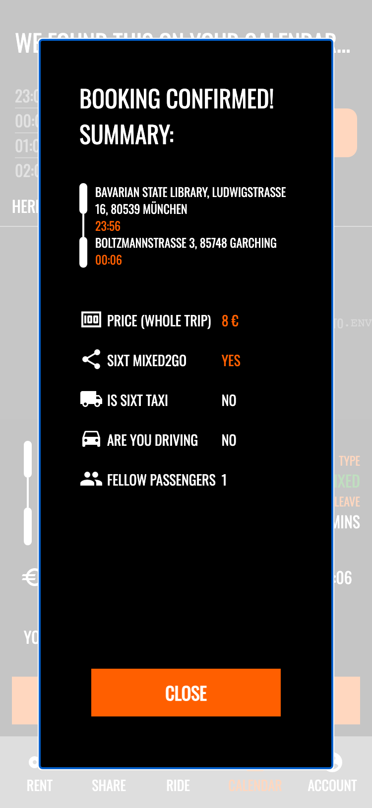

# Sixt Mixed

A hackathon prototype exploring how Sixt could combine calendar integration with ride-sharing to make shared mobility smarter, cheaper, and greener.

> **Note:** This is a demo with mock data. No real bookings are made.

---

## The Problem

Car-sharing vehicles carry **1.43 passengers on average**. Most trips are single-occupancy — wasting seats, crowding roads, and increasing emissions. At the same time, planning a shared ride in advance is unreliable: cars may not be available when you need them, and there is no way to coordinate with other riders heading the same way.

## The Idea

**Sixt Mixed** introduces two features that work together:

- **Sixt Calendar** reads your upcoming events and knows when and where you need to be. It suggests transport options — shared cars, private rentals, or taxis — timed so you arrive before your event starts.

- **Sixt Mixed2Go** lets you open your booked ride to other Sixt users heading the same direction. You share the car, split the cost, and take one more vehicle off the road.

### How it works

1. **Alice** has a meeting in Garching at 14:00. Sixt Calendar sees the event and offers her a Sixt Share car departing at 13:30.
2. Alice books the car and checks **"Open ride for Sixt Mixed2Go"**.
3. **Bob** also needs to get to Garching. His Sixt Calendar shows Alice's shared ride as a cheaper "Share Mixed" option alongside a private rental and a taxi.
4. Bob books the shared ride for €8 instead of €25 for a taxi. Both save money; one fewer car on the road.

---

## Screenshots

<p align="center">
  
  &nbsp;&nbsp;
  
  &nbsp;&nbsp;
  
</p>

<p align="center">
  <em>Left:</em> Calendar event with a shared ride offer showing route, price, and "On time" status<br>
  <em>Center:</em> Running late — the app highlights "10 mins late" in orange<br>
  <em>Right:</em> Booking confirmation with trip summary and Mixed2Go status
</p>

> The app is built with web technologies but designed as a **mobile app mockup** of the Sixt app.

---

## Demo Personas

Switch between three scenarios via the `?user=` query parameter:

| URL | Persona | Scenario |
|-----|---------|----------|
| `/?user=0` | Microsoft Developer | On time — passenger in a Sixt Mixed2Go shared car |
| `/?user=1` | TUM Student | On time — driving own car, can open it for Mixed2Go |
| `/?user=2` | LMU Student | Running late — all ride options arrive after the event starts |

All locations are real places in Munich (Bavarian State Library, TUM Garching, LMU main building).

---

## Tech Stack

| Layer | Technology |
|-------|-----------|
| Frontend | React 17, Material-UI v4, react-swipeable-views |
| Maps | HERE Maps JS SDK v3.1 (CDN) |
| Backend | Python 3, Flask 3, flask-cors |

---

## Getting Started

### Prerequisites

- Node.js 16+ and Yarn
- Python 3.9+

### 1. Backend

```bash
cd backend
pip install -r requirements.txt
flask --app app run --port 3001
```

The API serves mock data at `http://localhost:3001`. Times are computed relative to when the server starts, so the demo always shows realistic values.

### 2. Frontend

```bash
cd frontend
cp .env.example .env
yarn install
yarn start
```

The app opens at `http://localhost:3000`.

### 3. HERE Maps API key

The map shows the driving route between pickup and destination. To enable it:

1. Create a free account at [developer.here.com](https://developer.here.com)
2. Create a new project
3. Generate an API key — it needs **REST** access (for the Routing API v8) and **JavaScript** access (for the Maps SDK)
4. Paste the key into `frontend/.env`:
   ```
   REACT_APP_HERE_API_KEY=your_key_here
   ```
5. Restart the frontend dev server

Without a key, the app still works — the map area shows a placeholder instead.

---

## Presentation

See [`Presentation.pptx`](Presentation.pptx) in the repository root for the original hackathon pitch deck.
